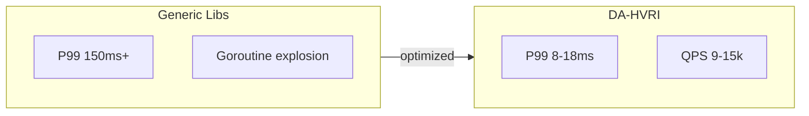

# DA-HVRI: Density-Adaptive Hierarchical Vector Routing Index

[English](README.md) | [中文](README.zh-CN.md)

> **Density-Adaptive Hierarchical Vector Routing Index** — An embedded vector search engine for Go, combining design principles from Milvus, FAISS, and Elasticsearch, optimized for single-machine high-concurrency scenarios.

**50k vectors / 32 concurrent, P99 under 15ms | Single-machine RAG vector search, pure Go, no GPU, no external deps**

[](https://go.dev/)
[](https://goreportcard.com/report/github.com/ic-timon/da-hvri)
[](LICENSE)
[]()
[]()
[]()
[]()

---

## Table of Contents

- [Why DA-HVRI?](#why-da-hvri)
- [30 Second Quick Start](#30-second-quick-start)
- [Design Inspiration](#design-inspiration)
- [Comparison with PQ and HNSW](#comparison-with-pq-and-hnsw)
- [Core Features](#core-features)
- [Technical Highlights](#technical-highlights)
- [Performance Benchmarks](#performance-benchmarks)
- [Quick Start](#quick-start)
- [Usage](#usage)
- [Project structure](#project-structure)
- [Config parameters](#config-parameters)
- [Roadmap](#roadmap)
- [License](#license)

---

## Why DA-HVRI?

In RAG, KAG, and multimodal retrieval, **P99 latency** of vector indexes often determines the user experience ceiling. Common issues with generic open-source libraries under single-machine high concurrency:

- **Goroutine explosion**: Hundreds of goroutines spawned per request; scheduling overhead and cache thrashing drive P99 to 150ms+
- **GC tail**: Heap pressure triggers stop-the-world; P99 collapses randomly
- **Lock contention**: Multiple goroutines compete for the same channel or map; throughput fails to scale linearly

**Generic libs P99 150ms+ vs DA-HVRI ~8–18ms**. DA-HVRI addresses these with systematic optimizations: **9k+ QPS on a single machine**, **mmap persist ≈ 4x heap**, deterministic P99. At **50k vectors, 32 concurrency**:



| Metric | Value |
|--------|-------|
| **QPS** | **~9–11k** (mmap single tree, 32 concurrent, batch=1) |
| **Batch QPS** | **~12–15k** (batch=8, one leaf scan serves multiple queries) |
| **P99 latency** | **~8–18 ms** (batch=1) / **~27–35 ms** (batch=8) |
| **Goroutine count** | **25** (Search Pool workers, stable) |
| **mmap persist** | **~4× search QPS vs heap** (contiguous blocks, cache-friendly) |

---

## Design Inspiration

DA-HVRI draws from mainstream vector search systems:

| Project | Inspiration |
|---------|-------------|
| **Milvus / Knowhere** | IVF partitioning + AVX-512 hardware acceleration, multi-core sharding |
| **FAISS** | Centroid routing, nprobe-style multi-path search |
| **Elasticsearch** | Dynamic sharding, off-heap to avoid GC pressure |

Unlike distributed solutions, DA-HVRI targets **single-machine deployment without GPU**, maximizing CPU cache and physical core affinity. It fits well as a local search engine for KAG/RAG applications.

---

## Comparison with PQ and HNSW

DA-HVRI competes with **PQ (Product Quantization)** and **HNSW (Hierarchical Navigable Small World)**. All three target approximate nearest neighbor search but differ in design and use cases:

| Dimension | DA-HVRI | PQ | HNSW |
|-----------|---------|-----|------|
| **Index structure** | Density-adaptive tree (K-means split) | Product quantization codebook + inverted | Multi-layer graph |
| **Build** | Online incremental, no pretraining | Requires codebook training (offline) | Online incremental |
| **Data adaptivity** | Structure evolves with density | Fixed codebook, retrain on distribution shift | Fixed graph, sensitive to distribution |
| **Memory** | Raw vectors + centroids (tunable) | Very low (compressed codes) | Higher (graph + vectors) |
| **Query path** | Tree routing + leaf scan | Table lookup + residual | Graph traversal (multi-hop) |
| **Concurrent P99** | **~8–18 ms** (mmap single-tree Search Pool + segmented prefetch) | Affected by locks/scheduling | Non-deterministic traversal, common tail |
| **Go ecosystem** | Pure Go + optional CGO | Mostly C++/Python bindings | Mostly C++/Rust bindings |
| **Embedded** | Single binary, no external deps | Needs pretrained codebook | Needs graph structure |

### When to choose DA-HVRI

- **RAG/KAG document stores**: 10k–200k vectors, incremental writes, stable P99
- **Go stack**: Index and business logic in the same language, no FFI
- **Single-machine embedded**: No separate vector service, index embedded in app process
- **Latency determinism**: P99/P50 ratio < 2, no random tail spikes

### When to choose PQ

- **Very large scale**: Millions of vectors, compression-first storage
- **Offline batch**: Index built once, no incremental updates

### When to choose HNSW

- **Recall-first**: Require high recall, acceptable higher latency variance
- **Existing integrations**: Milvus, Qdrant, etc. already integrate HNSW

---

## Core Features

### Density-Adaptive Hierarchical Tree

DA-HVRI’s core data structure: the index evolves with data density, without pre-specified cluster count or depth.

#### Structure

```
                    ┌─────────────────┐
                    │   Root (node)   │
                    └────────┬────────┘
                             │
                    ┌────────┴────────┐
                    ▼                 ▼
            ┌───────────────┐  ┌───────────────┐
            │ InternalNode  │  │ InternalNode   │  ← Centroid routing
            │  (2 children) │  │  (2 children) │
            └───────┬───────┘  └───────┬───────┘
                    │                  │
        ┌───────────┼───────────┐      │
        ▼           ▼           ▼      ▼
  ┌──────────┐ ┌──────────┐ ┌──────────┐ ┌──────────┐
  │ LeafNode │ │ LeafNode │ │ LeafNode │ │ LeafNode │  ← Leaf layer
  │ Block[]  │ │ Block[]  │ │ Block[]  │ │ Block[]  │    Contiguous blocks
  └──────────┘ └──────────┘ └──────────┘ └──────────┘
```

- **InternalNode**: Internal node with centroid vectors for routing
- **LeafNode**: Leaf node with DataBlocks, up to 64 vectors of 512 dims per block (configurable)
- **Block**: Contiguous memory block, heap or off-heap (C.malloc)

#### Split mechanism

When leaf vector count reaches `SplitThreshold` (default 512), **K-means K=2** split is triggered:

1. Collect all vectors and chunkIDs in the leaf
2. Initialize 2 centers randomly, iterate 8 rounds for clustering
3. Assign vectors to left/right sub-leaves by cluster label
4. Atomically replace the old leaf with a new InternalNode (left + right children)

Query path is lock-free: root and children use `atomic.Pointer[Node]`; after split, the read path sees a consistent snapshot.

#### Query flow: vector routing

1. Query vector enters at root
2. If InternalNode: compute dot products with centroids, pick best child (or multiple by PruneEpsilon)
3. If LeafNode: batch dot products in leaf blocks (AVX-512), return Top-K
4. Multi-path: each level can explore Top-SearchWidth children, deduplicate at leaves, merge Top-K

Structure adapts to density: sparse regions stay shallow, dense regions split into deeper levels.

---

### Multi-path search and adaptive pruning

- Top-K children per level (`SearchWidth`), balancing recall and latency
- `PruneEpsilon` pruning: only explore branches with `score >= maxScore - ε`

### Hardware acceleration

- **AVX-512** dot product and batch prefetch (`_mm_prefetch`), 10–30% faster leaf scan
- Conditional build: `amd64 && cgo` enables it (Windows/Linux); otherwise pure Go
- **Runtime**: CGO-built binary must run on an AVX-512-capable CPU, or use `CGO_ENABLED=0`

### Low GC impact

- **Off-heap** (C.malloc) for vector blocks; HeapSys reduced ~60%
- **Per-worker buffer reuse**: each Search Pool worker holds scores/indices/seen buffers; no allocation on P99 path

### High-concurrency determinism

- **Worker Pool**: Fixed workers instead of 16 goroutines per request; goroutines drop from ~512 to 17
- **Local queues**: Per-worker channels, route by `shardIdx % nWorkers` to avoid global contention
- **Physical core affinity**: Worker count `max(nShards, NumCPU/2)` to avoid hyperthread contention

### Single-tree Search Pool (mmap throttling)

- **SearchPoolWorkers**: Under high concurrency on mmap single tree, 32 goroutines hitting the same tree spike P99. Set `SearchPoolWorkers > 0` (recommended `NumCPU`) to enable a dedicated worker pool that caps concurrency, lowering P99/P50 and boosting QPS
- **Segmented prefetch**: Leaf scan changed from "prefetch all blocks at once" to "prefetch next block while processing current"; SIMD prefetch distance tuned (i+2), reducing cache pollution

### Batch search (SearchMultiPathBatch)

- **One leaf scan serves multiple queries**: Each block is read once and dot products are computed for all queries, improving memory bandwidth utilization
- **~30–60% QPS improvement**: At batch=8, 32-concurrent QPS reaches 12–15k
- Benchmark: `.\bench.exe -stage c -batch 8`

---

## Technical Highlights

- **AVX-512**: 16 float32 per step, 512 dims with no remainder, full SIMD dot product
- **Per-worker buffer reuse**: Zero allocation on P99 path, scores/indices/seen per worker
- **mmap contiguous blocks**: Cache-friendly, ~4x search QPS vs heap
- **Lock-free read path**: Tree nodes use `atomic.Pointer`, split is atomic replace
- **Density-adaptive tree**: Structure evolves with data density, no pre-specified cluster count

---

## Performance Benchmarks

### Windows (x86_64 AVX-512)

**Environment**: Windows / Go 1.21 / 512-dim vectors

#### 32-concurrent (50k vectors, mmap single tree, recommended)

Run: `.\bench.exe -stage c` (typical values from 6 consecutive runs)

| Concurrency | QPS | P50(ms) | P99(ms) | P99/P50 |
|-------------|-----|---------|---------|---------|
| 1 | ~1,500 | 0.52 | 2.00 | 3.8 |
| 4 | ~3,500 | 1.05 | 3.00 | 2.8 |
| 8 | ~5,500 | 1.10 | 4.50 | 4.0 |
| 16 | ~8,800 | 1.05 | 7.00 | 6.5 |
| 32 | **~9,500** | 1.5 | **~14** | 8 |

#### 32-concurrent (50k vectors, mmap single tree, batch=8)

Run: `.\bench.exe -stage c -batch 8` (typical values from 6 consecutive runs)

| Concurrency | QPS | P50(ms) | P99(ms) | P99/P50 |
|-------------|-----|---------|---------|---------|
| 1 | ~2,100 | 3.5 | 9 | 2.5 |
| 4 | ~5,000 | 6 | 9 | 1.5 |
| 8 | ~7,800 | 7 | 12 | 1.7 |
| 16 | ~12,000 | 7 | 21 | 3.0 |
| 32 | **~13,500** | 8 | **~29** | 3.5 |

With batch=8, one leaf scan serves 8 queries; QPS improves ~30–50%, suitable for batchable online scenarios.

#### 32-concurrent (50k vectors, 16 shards heap)

Run: `go run ./bench -stage c -shards 16 -offheap`

| Concurrency | QPS | P50(ms) | P99(ms) | P99/P50 |
|-------------|-----|---------|---------|---------|
| 1 | 800 | 1.00 | 2.45 | 2.44 |
| 4 | 975 | 4.18 | 6.28 | 1.50 |
| 8 | 1,136 | 7.07 | 11.78 | 1.67 |
| 16 | 1,439 | 10.88 | 19.22 | 1.77 |
| 32 | 1,911 | 16.76 | 25.69 | 1.53 |

#### Capacity (100k / 200k vectors, mmap)

Run: `go run ./bench -stage b`

| Scale | Search P50 | Search P99 | HeapSys |
|-------|-------------|-------------|---------|
| 100k | ~0 ms | ~0.6 ms | ~700 MB |
| 200k | ~0.5 ms | ~1.6 ms | ~2.8 GB |

#### CGO vs no CGO

Without CGO: pure Go dot product and heap memory. With CGO: AVX-512 and off-heap. (50k vectors, 16 shards)

| Concurrency | Metric | No CGO | CGO |
|-------------|--------|--------|-----|
| 1 | QPS | 701 | **887** |
| 1 | P50(ms) | 1.50 | **1.00** |
| 32 | QPS | 873 | **1,668** |
| 32 | P50(ms) | 37.31 | **18.32** |
| 32 | P99(ms) | 42.14 | **33.67** |

CGO yields ~1.9× QPS and lower P50/P99. Without CGO it still builds and runs, suitable when GCC is unavailable or for cross-compilation.

#### Heap vs mmap persist (stage d)

Run: `go run ./bench -stage d`

| Mode | QPS | P50 | P99 | Ratio |
|------|-----|-----|-----|-------|
| Heap | ~1,800 | ~7 ms | ~20 ms | baseline |
| **mmap persist** | **~7,100** | **~1.2 ms** | **~8 ms** | **~4×** |

mmap stores blocks contiguously in the file; sequential access improves CPU prefetch and cache locality over heap-scattered blocks. Use `NewTreeFromFile` or `cfg.PersistPath` for serving.

---

### Mac (Apple Silicon ARM64 NEON)

**Environment**: macOS / Go 1.21 / 512-dim vectors (Apple Silicon)

#### 32-concurrent (50k vectors, mmap single tree, recommended)

Run: `go run ./bench -stage c -offheap`

| Concurrency | QPS | P50(ms) | P99(ms) | P99/P50 |
|-------------|-----|---------|---------|---------|
| 1 | 1,965 | 0.47 | 1.23 | 2.59 |
| 4 | 4,316 | 0.83 | 2.14 | 2.57 |
| 8 | 5,831 | 1.14 | 4.05 | 3.55 |
| 16 | 5,985 | 1.40 | 15.97 | 11.42 |
| 32 | **6,069** | 2.52 | **19.96** | 7.91 |

#### 32-concurrent (50k vectors, 16 shards heap)

Run: `go run ./bench -stage c -shards 16 -offheap`

| Concurrency | QPS | P50(ms) | P99(ms) | P99/P50 |
|-------------|-----|---------|---------|---------|
| 1 | 819 | 1.15 | 2.02 | 1.76 |
| 4 | 942 | 4.08 | 6.99 | 1.71 |
| 8 | 976 | 8.01 | 13.48 | 1.68 |
| 16 | 924 | 16.51 | 36.86 | 2.23 |
| 32 | 1,040 | 30.36 | 50.98 | 1.68 |

#### Capacity (100k / 200k vectors, mmap)

Run: `go run ./bench -stage b`

| Scale | Search P50 | Search P99 | HeapSys |
|-------|-------------|-------------|---------|
| 100k | ~0.2 ms | ~0.3 ms | ~1.4 GB |
| 200k | ~1.3 ms | ~2.5 ms | ~2.8 GB |

#### Heap vs mmap persist (stage d)

Run: `go run ./bench -stage d`

| Mode | QPS | P50 | P99 | Ratio |
|------|-----|-----|-----|-------|
| Heap | ~1,015 | ~11.5 ms | ~67 ms | baseline |
| **mmap persist** | **~5,114** | **~1.5 ms** | **~21 ms** | **~5×** |

---

## 30 Second Quick Start

```go
package main

import (
	"fmt"
	"github.com/ic-timon/da-hvri/indexer"
)

func main() {
	cfg := indexer.DefaultConfig()
	idx := indexer.NewTree(cfg)
	vec := make([]float32, 512)
	vec[0] = 1.0 // simplified; use L2-normalized vectors in production
	idx.Add(vec, 0)
	idx.Add(vec, 1)
	results := idx.SearchMultiPath(vec, 2)
	for _, r := range results {
		fmt.Printf("chunk %d, score %.4f\n", r.ChunkID, r.Score)
	}
}
```

```bash
go get github.com/ic-timon/da-hvri
go run main.go
```

Run benchmark: `.\bench.exe -stage c` for QPS, P50, P99.

---

## Quick Start

### Dependencies

- Go 1.21+
- CGO (optional, for AVX-512 and off-heap)
- **Embedding model**: Development/benchmark uses BGE 512-dim (e.g. bge-small-zh-v1.5)
- **Windows**: MinGW-w64 or MSYS2, `gcc` in PATH
- **Linux**: build-essential (GCC) or Clang, `gcc`/`clang` in PATH

> **CGO runtime**: With CGO enabled, the binary must run on an x86_64 CPU with **AVX-512** support, or it may crash with SIGILL. On hosts without AVX-512, build with `CGO_ENABLED=0` to fall back to pure Go.

### Build and run

**Windows**

```powershell
# Enable CGO (recommended)
$env:CGO_ENABLED = "1"
go build -o bench.exe ./bench

# Benchmark (stage: a param tune | b capacity | c high concurrency | d heap vs mmap)
.\bench.exe -stage c
.\bench.exe -stage c -batch 8   # Batch search mode, higher QPS
.\bench.exe -stage c -shards 16 -offheap
.\bench.exe -stage d   # Compare mmap vs heap search performance
```

**Linux**

```bash
# With CGO (requires amd64 + AVX-512 CPU)
CGO_ENABLED=1 go build -o bench ./bench

# Without CGO (any amd64, no AVX-512 required)
CGO_ENABLED=0 go build -o bench ./bench

# Benchmark (stage: a|b|c|d)
./bench -stage c -shards 16 -offheap
./bench -stage d   # Compare mmap vs heap search performance
```

**macOS (Apple Silicon)**

```bash
# With CGO (ARM64 NEON acceleration)
CGO_ENABLED=1 go build -o bench ./bench

# Benchmark (stage: a|b|c|d)
./bench -stage c -offheap     # mmap single tree
./bench -stage c -shards 16 -offheap
./bench -stage d
```

---

## Usage

### 1. Index type

| Type | Use case | Create |
|------|----------|--------|
| **Single tree** | Small scale (< 10k), low concurrency | `indexer.NewTree(cfg)` |
| **Sharded index** | Medium/large scale, high concurrency | `indexer.NewShardedIndex(cfg, 16)` |

Sharded index routes vectors by `chunkID % nShards` to 16 trees; search queries all in parallel and merges results.

### 2. Config and creation

#### DefaultConfig

`DefaultConfig()` returns tuned defaults for 10k–200k vectors and moderate concurrency:

| Parameter | Default | Role | Tuning |
|-----------|---------|------|--------|
| **VectorsPerBlock** | 64 | vectors per block; ~128KB, fits L2; AVX-512 prefetches by block | 32 for less memory, 128 for fewer blocks; 64 is cache-friendly |
| **SplitThreshold** | 512 | leaf split threshold; triggers K=2 split | 128/256: deeper tree; 1024: shallower, lower latency |
| **SearchWidth** | 3 | children per level in multi-path | Higher: more recall, higher latency; 3 is a balance |
| **PruneEpsilon** | 0.1 | only enter branches with `score ≥ maxScore - ε` | 0.05: stricter; 0.2: looser |
| **UseOffheap** | false | use C.malloc for blocks | **Set true for production** (requires CGO) |
| **PersistPath** | "" | when non-empty and file exists, NewTree auto LoadFrom (mmap) | set when loading index for serving |
| **SearchPoolWorkers** | 0 | single-tree search pool worker count; enabled when >0 (mmap single-tree throttling) | recommended `NumCPU`; bench -stage c single-tree path auto-enables |

Recommended: `DefaultConfig()` + `UseOffheap = true` + `nShards = 16`.

```go
import "github.com/ic-timon/da-hvri/indexer"

// Default (recommended)
cfg := indexer.DefaultConfig()
cfg.UseOffheap = true

// Or custom
cfg := &indexer.Config{
    VectorsPerBlock: 64,
    SplitThreshold:  512,
    SearchWidth:     3,
    PruneEpsilon:    0.1,
    UseOffheap:        true,
    PersistPath:       "",  // set path for serving; NewTree auto mmap when file exists
    SearchPoolWorkers: 0,   // set NumCPU for mmap single-tree high-concurrency throttling
}

// Single tree
tree := indexer.NewTree(cfg)

// Sharded index (recommended)
idx := indexer.NewShardedIndex(cfg, 16)
```

### 3. Insert vectors

Vectors must be **512-dim**, **L2-normalized** `[]float32`. `chunkID` is your chunk identifier, returned as-is in results.

```go
// Single insert
vec := []float32{...}  // len == 512
ok := idx.Add(vec, uint64(chunkID))
if !ok {
    // invalid dimension or insert failed
}

// Batch insert (vec from embedding model or service)
for i, vec := range vectors {
    if !idx.Add(vec, uint64(ids[i])) {
        log.Fatalf("add failed id %d", ids[i])
    }
}
```

### 4. Search API

| Method | Description |
|--------|-------------|
| `Search(query, k)` | Single-path search, lowest latency |
| `SearchMultiPath(query, k)` | Multi-path search, higher recall |
| `SearchMultiPathBatch(queries, k)` | Batch multi-path search; one leaf scan serves multiple queries, ~30–60% QPS gain |

```go
// Single-query search
results := idx.SearchMultiPath(queryVec, 5)

// Batch search (for batchable scenarios)
batchQueries := [][]float32{vec1, vec2, vec3}
batchResults := idx.SearchMultiPathBatch(batchQueries, 5)
for i, rs := range batchResults {
    fmt.Printf("query %d: %d results\n", i, len(rs))
}
```

`SearchResult`:

```go
type SearchResult struct {
    ChunkID uint64   // chunk ID from Add
    Score   float64  // cosine similarity (dot product for L2-normalized)
}
```

### 5. Index-only (no embedder)

If you already have 512-dim vectors:

```go
cfg := indexer.DefaultConfig()
cfg.UseOffheap = true
idx := indexer.NewShardedIndex(cfg, 16)

// Insert
for i, vec := range myVectors {
    idx.Add(vec, uint64(myIDs[i]))
}

// Search
results := idx.SearchMultiPath(queryVec, 10)
```

### 6. Persistence and loading (~4× search QPS with mmap)

Build phase uses heap tree; after SaveToAtomic, the serving process loads via mmap (default; contiguous blocks yield better cache locality than heap):

```go
// Build process: Add -> SaveToAtomic
cfg := indexer.DefaultConfig()
tree := indexer.NewTree(cfg)
for i, vec := range vectors {
    tree.Add(vec, uint64(ids[i]))
}
if err := tree.SaveToAtomic("/path/to/index.bin"); err != nil {
    log.Fatal(err)
}

// Serving process: NewTreeFromFile or cfg.PersistPath + NewTree (mmap default)
tree, err := indexer.NewTreeFromFile("/path/to/index.bin", cfg)
if err != nil { log.Fatal(err) }
defer tree.ClosePersisted()
results := tree.SearchMultiPath(queryVec, 5)
```

Or use `cfg.PersistPath`:

```go
cfg.PersistPath = "/path/to/index.bin"
tree := indexer.NewTree(cfg)  // auto LoadFrom (mmap) if file exists
defer tree.ClosePersisted()
```

mmap is the default load path; blocks are contiguous in the file for better cache locality. Use `indexer.AppendTo(path, vecs, ids, cfg)` for incremental updates. Call `ClosePersisted()` on exit to release the mmap.

### 7. Notes

- **Vector dimension**: Must be 512
  - **AVX-512**: `__m512` processes 16 float32 per step; 512/16=32 iterations, no scalar tail
  - **L1/L2-friendly**: 2KB per vector, 64 vectors ~128KB per block within L2; prefetch with contiguous layout
  - Matches `indexer.BlockDim` and common embedding models (e.g. BGE 512-dim)
- **Normalization**: Vectors must be L2-normalized or dot product is not cosine similarity
- **CGO**: `UseOffheap=true` requires CGO; falls back to heap when CGO is disabled
- **Concurrency**: `Add` and `SearchMultiPath` are safe to call concurrently; tree read path is lock-free

---

## Project structure

```
.
├── indexer/          # Index core
│   ├── tree.go       # Dynamic descending tree
│   ├── search.go     # Multi-path search + SearchMultiPathBatch
│   ├── search_bufs.go# Per-worker buffers, seenSlice
│   ├── shard.go      # Sharded index + Worker Pool
│   ├── persist.go    # SaveToAtomic / LoadFrom / NewTreeFromFile / AppendTo
│   ├── block_mmap.go # mmap blocks (read-only, default for search)
│   ├── store/        # Persist format and mmap store
│   └── ...
├── simd/             # AVX-512 dot product (CGO)
└── bench/            # Benchmarks (stage a|b|c|d)
```

---

## Config parameters

| Parameter | Default | Description |
|-----------|---------|-------------|
| VectorsPerBlock | 64 | Vectors per block |
| SplitThreshold | 512 | Leaf split threshold |
| SearchWidth | 3 | Multi-path search width |
| PruneEpsilon | 0.1 | Adaptive pruning threshold |
| UseOffheap | false | Enable C.malloc |
| PersistPath | "" | Serving load path; NewTree auto mmap |
| SearchPoolWorkers | 0 | Single-tree search pool workers; enabled when >0 (mmap throttling) |

---

## Roadmap

- **Go 1.26 SIMD migration**: Go plans to add standard library SIMD support in 1.26. The project will evaluate migrating the CGO/SIMD implementation to the official API once released, reducing CGO dependency and simplifying build/cross-compilation. Existing AVX-512/AVX2/SSE4/NEON implementations will remain for backward compatibility until migration.

---

## License

MIT
