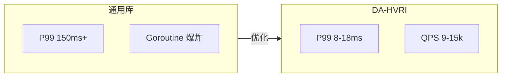

# DA-HVRI：基于密度自适应的层级化向量路由索引

[English](README.md) | [中文](README.zh-CN.md)

> **Density-Adaptive Hierarchical Vector Routing Index** — 专为 Go 打造的嵌入式向量检索引擎，融合 Milvus、FAISS、Elasticsearch 的设计精髓，针对单机高并发场景深度优化。

**50k 向量 / 32 并发，P99 稳在 15ms 内 | 单机 RAG 向量检索，Go 原生、无 GPU、无外部依赖**

[](https://go.dev/)
[](https://goreportcard.com/report/github.com/ic-timon/da-hvri)
[](LICENSE)
[]()
[]()
[]()
[]()

---

## 目录

- [为什么选择 DA-HVRI？](#为什么选择-da-hvri)
- [30 秒上手](#30-秒上手)
- [设计灵感与对标](#设计灵感与对标)
- [与 PQ、HNSW 的对比](#与-pqhnsw-的对比)
- [核心特性](#核心特性)
- [技术亮点](#技术亮点)
- [性能基准](#性能基准)
- [快速开始](#快速开始)
- [使用说明](#使用说明)
- [项目结构](#项目结构)
- [配置参数](#配置参数)
- [未来规划](#未来规划)
- [License](#license)

---

## 为什么选择 DA-HVRI？

在 RAG、KAG 与多模态检索场景中，向量索引的 **P99 延迟** 往往决定用户体验上限。通用开源库在单机高并发下常见问题：

- **协程爆炸**：每请求 spawn 数百 goroutine，调度开销与缓存抖动导致 P99 飙升至 150ms+
- **GC 长尾**：堆内存压力触发 stop-the-world，P99 随机崩塌
- **锁竞争**：多 goroutine 争抢同一 channel 或 map，吞吐量难以线性扩展

**通用库 P99 150ms+ vs DA-HVRI 约 8–18ms**。DA-HVRI 针对上述痛点进行了系统性优化：**9k+ QPS 单机破万**，**mmap 持久化 ≈ 4x heap**，P99 确定性可控。在 **50k 向量、32 并发** 下：



| 指标 | 数值 |
|------|------|
| **QPS** | **约 9–11k**（mmap 单树 32 并发，batch=1） |
| **Batch QPS** | **约 12–15k**（batch=8，一次 leaf 扫描服务多 query） |
| **P99 延迟** | **约 8–18 ms**（batch=1）/ **约 27–35 ms**（batch=8） |
| **Goroutine 数** | **25**（Search Pool worker 常驻，稳定） |
| **mmap 持久化** | **检索 QPS 约 4x 于纯内存**（块连续布局，cache 友好） |

---

## 设计灵感与对标

DA-HVRI 的设计理念借鉴了业界主流向量检索系统的核心思想：

| 项目 | 借鉴点 |
|------|--------|
| **Milvus / Knowhere** | IVF 分区 + AVX-512 硬件加速，多核分片架构 |
| **FAISS** | 聚类中心路由、`nprobe` 风格的多路径检索 |
| **Elasticsearch** | 动态分片、Off-heap 规避 GC 压力 |

与分布式方案不同，DA-HVRI 面向 **无GPU单机部署** 场景，极致利用 CPU 缓存与物理核亲和性，更适合作为 KAG/RAG 应用的本地检索引擎。

---

## 与 PQ、HNSW 的对比

DA-HVRI 的核心竞品是 **PQ（Product Quantization）** 与 **HNSW（Hierarchical Navigable Small World）**。三者均面向近似最近邻检索，但设计哲学与适用场景不同：

| 维度 | DA-HVRI | PQ | HNSW |
|------|---------|-----|------|
| **索引结构** | 密度自适应树（K-means 分裂） | 乘积量化码本 + 倒排 | 多层图 |
| **构建方式** | 在线增量，无预训练 | 需训练码本（离线） | 在线增量 |
| **数据适应性** | 结构随密度自动演化 | 固定码本，分布变化需重训 | 图结构固定，对分布敏感 |
| **内存占用** | 原始向量 + 质心（可控） | 极低（压缩码） | 较高（图 + 向量） |
| **查询路径** | 树路由 + 叶子扫描 | 查表 + 残差计算 | 图遍历（多跳） |
| **并发 P99** | **约 8–18 ms**（mmap 单树 Search Pool + 分段预取） | 易受锁/调度影响 | 图遍历非确定性，长尾常见 |
| **Go 生态** | 纯 Go + CGO 可选 | 多为 C++/Python 绑定 | 多为 C++/Rust 绑定 |
| **嵌入式部署** | 单二进制，无外部依赖 | 需加载预训练码本 | 需加载图结构 |

### 何时选 DA-HVRI？

- **RAG/KAG 文档库**：10k–200k 向量，增量写入，需稳定 P99
- **Go 技术栈**：希望索引与业务同语言，无 FFI 跨调用
- **单机嵌入式**：无独立向量服务，索引内嵌应用进程
- **延迟确定性**：P99/P50 比值 < 2，拒绝随机长尾

### 何时选 PQ？

- **超大规模**：百万级以上的压缩存储优先
- **离线批处理**：索引一次性构建，不需增量更新

### 何时选 HNSW？

- **召回优先**：对召回率要求极高，可接受更高延迟方差
- **已有成熟实现**：如 Milvus、Qdrant 等已深度集成 HNSW

---

## 核心特性

### 密度自适应下沉树（Density-Adaptive Hierarchical Tree）

DA-HVRI 的核心数据结构，索引结构随数据密度自动演化，无需预先指定聚类数或层级深度。

#### 结构组成

```
                    ┌─────────────────┐
                    │   Root (节点)   │
                    └────────┬────────┘
                             │
                    ┌────────┴────────┐
                    ▼                 ▼
            ┌───────────────┐  ┌───────────────┐
            │ InternalNode  │  │ InternalNode   │  ← 质心路由层
            │  (2 个子节点)  │  │  (2 个子节点)  │
            └───────┬───────┘  └───────┬───────┘
                    │                  │
        ┌───────────┼───────────┐      │
        ▼           ▼           ▼      ▼
  ┌──────────┐ ┌──────────┐ ┌──────────┐ ┌──────────┐
  │ LeafNode │ │ LeafNode │ │ LeafNode │ │ LeafNode │  ← 叶子层
  │ Block[]  │ │ Block[]  │ │ Block[]  │ │ Block[]  │    连续内存块
  └──────────┘ └──────────┘ └──────────┘ └──────────┘
```

- **InternalNode**：内部节点，含 2 个质心向量（Centroid），用于路由决策
- **LeafNode**：叶子节点，挂载若干 DataBlock，每块最多 64 个 512 维向量（可配置）
- **Block**：连续内存块，支持堆内存或 Off-heap（C.malloc）

#### 下沉分裂（Split）机制

当叶子节点向量数达到 `SplitThreshold`（默认 512）时，自动触发 **K-means K=2** 分裂：

1. 收集叶子内所有向量与 chunkID
2. 随机初始化 2 个中心，迭代 8 轮进行聚类
3. 按簇标签分配向量到左/右子叶子
4. 原子替换旧叶子为新的 InternalNode（左子节点 + 右子节点）

查询路径无需加锁：根节点与子节点均为 `atomic.Pointer[Node]`，分裂完成后原子替换，读路径始终看到一致快照。

#### 查询流程：向量路由

1. 查询向量进入根节点
2. 若为 InternalNode：计算与各质心的点积，选择得分最高的子节点（或按 PruneEpsilon 进入多个分支）
3. 若为 LeafNode：在叶子块内做批量点积（AVX-512），返回 Top-K
4. 多路径检索：每层可选 Top-SearchWidth 个子节点，叶子去重后合并全局 Top-K

结构随数据密度自动演化：稀疏区域保持浅层，密集区域自动下沉为多层级，实现「密度自适应」。

---

### 多路径检索与自适应剪枝

- 每层选取 Top-K 子节点（`SearchWidth`），平衡召回与延迟
- `PruneEpsilon` 剪枝：仅进入 `score >= maxScore - ε` 的分支，减少无效遍历

### 硬件级加速

- **AVX-512** 点积与批量预取（`_mm_prefetch`），叶子扫描 10–30% 加速
- 条件编译：`amd64 && cgo` 启用（Windows/Linux 通用），否则回退纯 Go
- **运行时**：CGO 构建的二进制需在支持 AVX-512 的 CPU 上运行，否则使用 `CGO_ENABLED=0`

### 零 GC 干扰

- **Off-heap**（`C.malloc`）分配向量块，HeapSys 降低约 60%
- **Per-worker 复用**：每个 Search Pool worker 持有 scores/indices/seen 等 buffer，P99 路径无分配

### 高并发确定性

- **Worker Pool**：常驻 worker 替代每请求 spawn 16 goroutine，goroutine 数从 ~512 压至 17
- **本地队列**：每 worker 独立 channel，按 `shardIdx % nWorkers` 路由，消除全局 channel 竞争
- **物理核亲和**：worker 数 `max(nShards, NumCPU/2)`，规避超线程竞争

### 单树 Search Pool（mmap 限流）

- **SearchPoolWorkers**：mmap 单树高并发下，32 个 goroutine 同时访问同一棵树导致 P99 飙高。配置 `SearchPoolWorkers > 0`（推荐 `NumCPU`）时，启用单树专用 worker 池，将并发度限制在 worker 数，显著降低 P99/P50、提升 QPS
- **分段式预取**：叶子扫描时由「一次性预取整棵 leaf 所有 block」改为「边用边预取下一个 block」，SIMD 层预取距离调优（i+2），减少 cache 污染

### 批量查询（SearchMultiPathBatch）

- **一次 leaf 扫描服务多 query**：每个 block 只读一次，对多个 query 同时计算点积，提高内存带宽利用率
- **QPS 提升约 30–60%**：batch=8 时 32 并发 QPS 可达 12–15k
- 压测：`.\bench.exe -stage c -batch 8`

---

## 技术亮点

- **AVX-512**：一次 16 个 float32，512 维无余数，点积全程 SIMD
- **Per-worker 复用**：P99 路径零分配，scores/indices/seen 常驻 worker
- **mmap 块连续布局**：cache 友好，检索 QPS 约 4x heap
- **无锁读路径**：树节点 `atomic.Pointer`，分裂原子替换
- **密度自适应树**：结构随数据密度自动演化，无需预指定聚类数

---

## 性能基准

### Windows（x86_64 AVX-512）

**环境**：Windows / Go 1.21 / 512 维向量

#### 32 并发压测（50k 向量，mmap 单树，推荐）

压测命令：`.\bench.exe -stage c`（6 次连测取典型值）

| 并发 | QPS | P50(ms) | P99(ms) | P99/P50 |
|------|-----|---------|---------|---------|
| 1 | ~1,500 | 0.52 | 2.00 | 3.8 |
| 4 | ~3,500 | 1.05 | 3.00 | 2.8 |
| 8 | ~5,500 | 1.10 | 4.50 | 4.0 |
| 16 | ~8,800 | 1.05 | 7.00 | 6.5 |
| 32 | **~9,500** | 1.5 | **~14** | 8 |

#### 32 并发压测（50k 向量，mmap 单树，batch=8）

压测命令：`.\bench.exe -stage c -batch 8`（6 次连测取典型值）

| 并发 | QPS | P50(ms) | P99(ms) | P99/P50 |
|------|-----|---------|---------|---------|
| 1 | ~2,100 | 3.5 | 9 | 2.5 |
| 4 | ~5,000 | 6 | 9 | 1.5 |
| 8 | ~7,800 | 7 | 12 | 1.7 |
| 16 | ~12,000 | 7 | 21 | 3.0 |
| 32 | **~13,500** | 8 | **~29** | 3.5 |

batch=8 时一次 leaf 扫描服务 8 个 query，QPS 提升约 30–50%，适合可攒批的在线场景。

#### 32 并发压测（50k 向量，16 分片 heap）

压测命令：`go run ./bench -stage c -shards 16 -offheap`

| 并发 | QPS | P50(ms) | P99(ms) | P99/P50 |
|------|-----|---------|---------|---------|
| 1 | 800 | 1.00 | 2.45 | 2.44 |
| 4 | 975 | 4.18 | 6.28 | 1.50 |
| 8 | 1,136 | 7.07 | 11.78 | 1.67 |
| 16 | 1,439 | 10.88 | 19.22 | 1.77 |
| 32 | 1,911 | 16.76 | 25.69 | 1.53 |

#### 容量扩展（100k / 200k 向量，mmap）

压测命令：`go run ./bench -stage b`

| 规模 | 搜索 P50 | 搜索 P99 | HeapSys |
|------|----------|----------|---------|
| 100k | ~0 ms | ~0.6 ms | ~700 MB |
| 200k | ~0.5 ms | ~1.6 ms | ~2.8 GB |

#### 纯内存 vs mmap 持久化（stage d）

压测命令：`go run ./bench -stage d`

| 模式 | QPS | P50 | P99 | 对比 |
|------|-----|-----|-----|------|
| 纯内存 heap | ~1,800 | ~7 ms | ~20 ms | 基准 |
| **mmap 持久化** | **~7,100** | **~1.2 ms** | **~8 ms** | **约 4×** |

mmap 将块序存储在文件中，检索时顺序访问，CPU 预取与 cache 局部性显著优于 heap 分散分配。服务端推荐 `NewTreeFromFile` 或 `cfg.PersistPath` 默认走 mmap。

#### CGO 与 无 CGO 对比

无 CGO 时回退到纯 Go 点积与堆内存；CGO 启用 AVX-512 与 Off-heap，QPS 约可提升 1.9 倍。无 CGO 时仍可正常编译运行，适合无 GCC 或交叉编译场景。

---

### Mac（Apple Silicon ARM64 NEON）

**环境**：macOS / Go 1.21 / 512 维向量（Apple Silicon）

#### 32 并发压测（50k 向量，mmap 单树，推荐）

压测命令：`go run ./bench -stage c -offheap`

| 并发 | QPS | P50(ms) | P99(ms) | P99/P50 |
|------|-----|---------|---------|---------|
| 1 | 1,965 | 0.47 | 1.23 | 2.59 |
| 4 | 4,316 | 0.83 | 2.14 | 2.57 |
| 8 | 5,831 | 1.14 | 4.05 | 3.55 |
| 16 | 5,985 | 1.40 | 15.97 | 11.42 |
| 32 | **6,069** | 2.52 | **19.96** | 7.91 |

#### 32 并发压测（50k 向量，16 分片 heap）

压测命令：`go run ./bench -stage c -shards 16 -offheap`

| 并发 | QPS | P50(ms) | P99(ms) | P99/P50 |
|------|-----|---------|---------|---------|
| 1 | 819 | 1.15 | 2.02 | 1.76 |
| 4 | 942 | 4.08 | 6.99 | 1.71 |
| 8 | 976 | 8.01 | 13.48 | 1.68 |
| 16 | 924 | 16.51 | 36.86 | 2.23 |
| 32 | 1,040 | 30.36 | 50.98 | 1.68 |

#### 容量扩展（100k / 200k 向量，mmap）

压测命令：`go run ./bench -stage b`

| 规模 | 搜索 P50 | 搜索 P99 | HeapSys |
|------|----------|----------|---------|
| 100k | ~0.2 ms | ~0.3 ms | ~1.4 GB |
| 200k | ~1.3 ms | ~2.5 ms | ~2.8 GB |

#### 纯内存 vs mmap 持久化（stage d）

压测命令：`go run ./bench -stage d`

| 模式 | QPS | P50 | P99 | 对比 |
|------|-----|-----|-----|------|
| 纯内存 heap | ~1,015 | ~11.5 ms | ~67 ms | 基准 |
| **mmap 持久化** | **~5,114** | **~1.5 ms** | **~21 ms** | **约 5×** |

---

## 30 秒上手

```go
package main

import (
	"fmt"
	"github.com/ic-timon/da-hvri/indexer"
)

func main() {
	cfg := indexer.DefaultConfig()
	idx := indexer.NewTree(cfg)
	vec := make([]float32, 512)
	vec[0] = 1.0 // 简化示例，实际需 L2 归一化
	idx.Add(vec, 0)
	idx.Add(vec, 1)
	results := idx.SearchMultiPath(vec, 2)
	for _, r := range results {
		fmt.Printf("chunk %d, score %.4f\n", r.ChunkID, r.Score)
	}
}
```

```bash
go get github.com/ic-timon/da-hvri
go run main.go
```

压测可立即体验性能：`.\bench.exe -stage c` → 输出 QPS、P50、P99 等。

---

## 快速开始

### 依赖

- Go 1.21+
- CGO（可选，用于 AVX-512 与 Off-heap）
- **嵌入模型**：开发/压测使用 BGE 512 维（如 bge-small-zh-v1.5）
- **Windows**：MinGW-w64 或 MSYS2，`gcc` 在 `PATH` 中
- **Linux**：`build-essential`（GCC）或 Clang，`gcc`/`clang` 在 `PATH` 中

> **CGO 运行时要求**：启用 CGO 构建时，二进制需在支持 **AVX-512** 的 x86_64 CPU 上运行，否则可能出现 `SIGILL` 崩溃。若部署环境无 AVX-512（如老旧云主机），请使用 `CGO_ENABLED=0` 构建，将回退到纯 Go 实现。

### 构建与运行

**Windows**

```powershell
# 启用 CGO（推荐）
$env:CGO_ENABLED = "1"
go build -o bench.exe ./bench

# 压测（stage: a 参数寻优 | b 容量扩展 | c 高并发 | d 纯内存 vs mmap）
.\bench.exe -stage c
.\bench.exe -stage c -batch 8   # 批量查询模式，QPS 更高
.\bench.exe -stage c -shards 16 -offheap
.\bench.exe -stage d   # 对比 mmap 与纯内存检索性能
```

**Linux**

```bash
# 启用 CGO（需 amd64 + AVX-512 CPU）
CGO_ENABLED=1 go build -o bench ./bench

# 无 CGO（任意 amd64，无 AVX-512 要求）
CGO_ENABLED=0 go build -o bench ./bench

# 压测（stage: a|b|c|d）
./bench -stage c -shards 16 -offheap
./bench -stage d   # 对比 mmap 与纯内存检索性能
```

**macOS（Apple Silicon）**

```bash
# 启用 CGO（ARM64 NEON 加速）
CGO_ENABLED=1 go build -o bench ./bench

# 压测（stage: a|b|c|d）
./bench -stage c -offheap     # mmap 单树
./bench -stage c -shards 16 -offheap
./bench -stage d
```

---

## 使用说明

### 1. 索引类型选择

| 类型 | 适用场景 | 创建方式 |
|------|----------|----------|
| **单树** | 小规模（< 10k）、低并发 | `indexer.NewTree(cfg)` |
| **分片索引** | 中大规模、高并发 | `indexer.NewShardedIndex(cfg, 16)` |

分片索引将向量按 `chunkID % nShards` 路由到 16 棵独立树，检索时并行查询后合并，适合 RAG/KAG 中的大规模文档库。

### 2. 配置与创建

#### DefaultConfig 配置说明

`DefaultConfig()` 返回针对本架构调优的默认值，适合 10k–200k 向量、中等并发场景。各参数含义与调优建议：

| 参数 | 默认 | 在本架构下的作用 | 调优建议 |
|------|------|------------------|----------|
| **VectorsPerBlock** | 64 | 每块向量数，块大小 = 64×512×4 ≈ 128KB，落在 L2 缓存范围，AVX-512 批量预取以块为单位 | 32 更省内存、128 更少块数；保持 64 对 cache 最友好 |
| **SplitThreshold** | 512 | 叶子内向量数达此值触发 K=2 分裂，树深度自适应 | 128/256 树更深、召回更精细；1024 树更浅、延迟更低 |
| **SearchWidth** | 3 | 每层进的子节点数，多路径检索 | 增大召回更高、延迟上升；3 为延迟/召回平衡点 |
| **PruneEpsilon** | 0.1 | 仅进入 `score ≥ maxScore - ε` 的分支 | 0.05 更严格剪枝、0.2 更宽松，一般保持默认 |
| **UseOffheap** | false | 为 true 时用 C.malloc 分配块，减少 GC | **生产高并发建议 true**（需 CGO） |
| **PersistPath** | "" | 非空且文件存在时，NewTree 自动从该路径 LoadFrom（mmap） | 服务端加载索引时设置 |
| **SearchPoolWorkers** | 0 | 单树 search pool worker 数，>0 时启用（mmap 单树高并发限流） | 推荐 `NumCPU`，bench -stage c 单树路径自动启用 |

分片索引推荐：`DefaultConfig()` + `UseOffheap = true` + `nShards = 16`。

```go
import "github.com/ic-timon/da-hvri/indexer"

// 默认配置（推荐）
cfg := indexer.DefaultConfig()
cfg.UseOffheap = true  // 生产环境建议开启

// 或自定义
cfg := &indexer.Config{
    VectorsPerBlock:   64,  // 每块向量数
    SplitThreshold:    512, // 叶子分裂阈值
    SearchWidth:       3,   // 多路径宽度
    PruneEpsilon:      0.1, // 剪枝阈值
    UseOffheap:        true, // 启用 C.malloc（需 CGO）
    PersistPath:       "",  // 服务端加载时设置路径，NewTree 自动 mmap
    SearchPoolWorkers: 0,   // mmap 单树高并发时设 NumCPU 限流
}

// 单树（小规模）
tree := indexer.NewTree(cfg)

// 分片索引（推荐）
idx := indexer.NewShardedIndex(cfg, 16)
```

### 3. 插入向量

向量必须为 **512 维**、**L2 归一化** 的 `[]float32`。`chunkID` 为业务侧 chunk 唯一标识，检索结果中会原样返回。

```go
// 单条插入
vec := []float32{...}  // len == 512
ok := idx.Add(vec, uint64(chunkID))
if !ok {
    // 向量维度错误或插入失败
}

// 批量插入（vec 从嵌入模型或服务获取）
for i, vec := range vectors {
    if !idx.Add(vec, uint64(ids[i])) {
        log.Fatalf("添加失败 id %d", ids[i])
    }
}
```

### 4. 检索 API

| 方法 | 说明 |
|------|------|
| `Search(query, k)` | 单路径检索，每层只走得分最高分支，延迟最低 |
| `SearchMultiPath(query, k)` | 多路径检索，每层进 Top-SearchWidth 分支，召回更高 |
| `SearchMultiPathBatch(queries, k)` | 批量多路径检索，一次 leaf 扫描服务多 query，QPS 提升约 30–60% |

```go
// 单 query 检索
results := idx.SearchMultiPath(queryVec, 5)

// 批量检索（适合可攒批场景）
batchQueries := [][]float32{vec1, vec2, vec3}
batchResults := idx.SearchMultiPathBatch(batchQueries, 5)
for i, rs := range batchResults {
    fmt.Printf("query %d: %d results\n", i, len(rs))
}
```

`SearchResult` 结构体：

```go
type SearchResult struct {
    ChunkID uint64   // 插入时传入的 chunk 标识
    Score   float64  // 余弦相似度（点积，因已 L2 归一化）
}
```

### 5. 仅使用索引模块

若你已有 512 维向量（如从其他嵌入服务获取），可直接使用 indexer：

```go
cfg := indexer.DefaultConfig()
cfg.UseOffheap = true
idx := indexer.NewShardedIndex(cfg, 16)

// 插入
for i, vec := range myVectors {
    idx.Add(vec, uint64(myIDs[i]))
}

// 检索
results := idx.SearchMultiPath(queryVec, 10)
```

### 6. 持久化与加载（mmap 默认，检索 QPS 约 4x）

构建阶段用 heap 树插入向量，持久化后服务端用 mmap 加载（默认，块连续布局，检索性能显著优于 heap）：

```go
// 构建进程：Add -> SaveToAtomic
cfg := indexer.DefaultConfig()
tree := indexer.NewTree(cfg)
for i, vec := range vectors {
    tree.Add(vec, uint64(ids[i]))
}
if err := tree.SaveToAtomic("/path/to/index.bin"); err != nil {
    log.Fatal(err)
}

// 服务进程：NewTreeFromFile 或 cfg.PersistPath + NewTree（mmap 默认）
tree, err := indexer.NewTreeFromFile("/path/to/index.bin", cfg)
if err != nil { log.Fatal(err) }
defer tree.ClosePersisted()
results := tree.SearchMultiPath(queryVec, 5)
```

或使用 `cfg.PersistPath`：

```go
cfg.PersistPath = "/path/to/index.bin"
tree := indexer.NewTree(cfg)  // 若文件存在则自动 LoadFrom（mmap）
defer tree.ClosePersisted()
```

mmap 为默认加载方式，块在文件中连续存储，检索时 cache 局部性更好。增量追加可用 `indexer.AppendTo(path, vecs, ids, cfg)`。退出时务必调用 `ClosePersisted()` 释放 mmap。

### 7. 注意事项

- **向量维度**：必须为 512
  - **AVX-512**：`__m512` 一次处理 16 个 float32，512÷16=32 次循环，无余数、无标量尾部，点积全程 SIMD
  - **L1/L2 友好**：单向量 512×4=2KB，可完整放入 L1d（典型 32KB）；每块 64 向量 ≈128KB，落在 L2 范围，预取 `_mm_prefetch` 配合连续布局，减少 cache miss
  - 与 `indexer.BlockDim` 及常见嵌入模型（如 BGE 512 维）一致
- **归一化**：向量需 L2 归一化，否则点积不能表示余弦相似度
- **CGO**：`UseOffheap=true` 需 CGO；禁用 CGO 时自动回退堆内存
- **并发**：`Add` 与 `SearchMultiPath` 可并发调用，树结构读路径无锁

---

## 项目结构

```
.
├── indexer/          # 索引核心
│   ├── tree.go       # 动态下沉树
│   ├── search.go     # 多路径检索 + SearchMultiPathBatch
│   ├── search_bufs.go# Per-worker 复用、seenSlice
│   ├── shard.go      # 分片索引 + Worker Pool
│   ├── persist.go    # SaveToAtomic / LoadFrom / NewTreeFromFile / AppendTo
│   ├── block_mmap.go # mmap 块（只读，默认检索）
│   ├── store/        # 持久化格式与 mmap store
│   └── ...
├── simd/             # AVX-512 点积（CGO）
└── bench/            # 压测（stage a|b|c|d）
```

---

## 配置参数

| 参数 | 默认 | 说明 |
|------|------|------|
| VectorsPerBlock | 64 | 每块向量数 |
| SplitThreshold | 512 | 叶子分裂阈值 |
| SearchWidth | 3 | 多路径搜索宽度 |
| PruneEpsilon | 0.1 | 自适应剪枝阈值 |
| UseOffheap | false | 启用 C.malloc |
| PersistPath | "" | 服务端加载路径，NewTree 自动 mmap |
| SearchPoolWorkers | 0 | 单树 search pool worker 数，>0 时启用（mmap 限流） |

---

## 未来规划

- **Go 1.26 SIMD 迁移**：Go 官方计划在 1.26 版本引入标准库 SIMD 支持。项目将评估在稳定版发布后，将 CGO/SIMD 实现迁移至官方接口，以降低 CGO 依赖、简化构建与交叉编译。迁移前仍保留现有 AVX-512/AVX2/SSE4/NEON 实现，确保向后兼容。

---

## License

MIT
